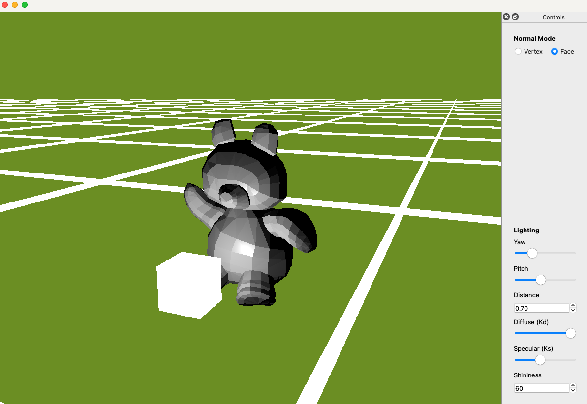
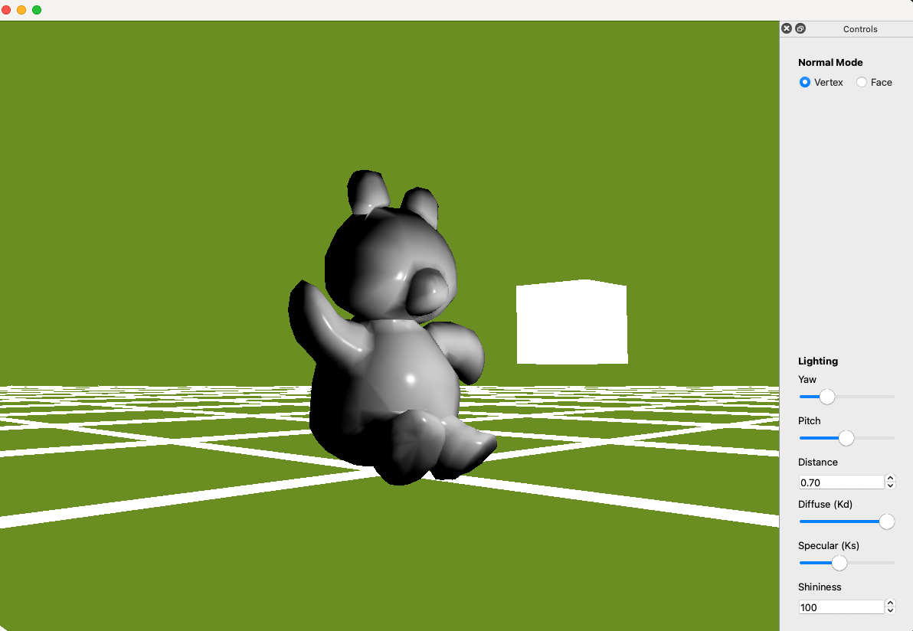

# obj_viewer




## Overview
obj_viewer is a lightweight **Qt 6** desktop application for quick inspection of 3D assets.

* **Format support** – OBJ by default 
* **Real-time Phong shading** with adjustable **diffuse, specular, shininess**
* **Normal-mode toggle** – per-vertex ⇄ per-face
* **Orbit camera** – drag to rotate, mouse-wheel to zoom
* **Interactive lighting** – sliders for yaw / pitch / distance + visible light-marker cube

---

## Build & Run

macOS
```bash
git clone --recursive https://github.com/whencanibe/obj_viewer.git
cd obj_viewer
cmake -B build -DCMAKE_BUILD_TYPE=Release
cmake --build build -j
build/obj_viewer         
```